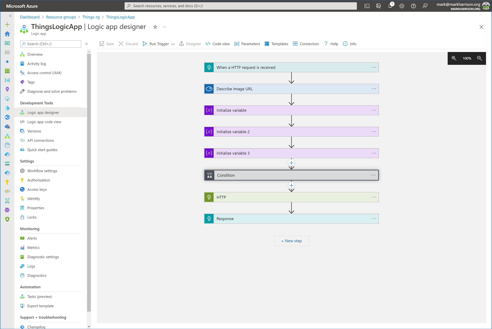
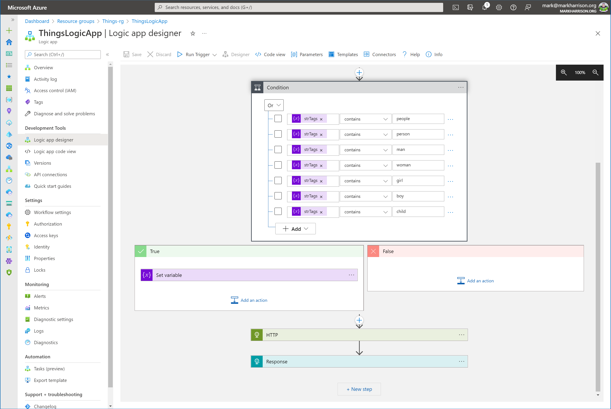
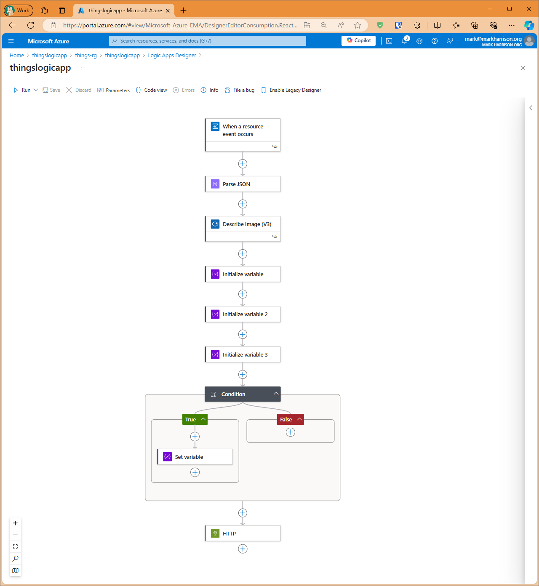

# ThingsLogicApp V1

Example response for AppDev Challenge <https://markharrison.io/appdev-challenge/>

Complete solution <https://markharrison.io/appdev-challenge/day2-complete>

## Infrastructure as Code

<https://github.com/markharrison/ThingsLogicAppV1/blob/main/infra/README.md>

## Updated 

20 June 2024 - v1.1 Use Event Grid subscription trigger rather than webhook

